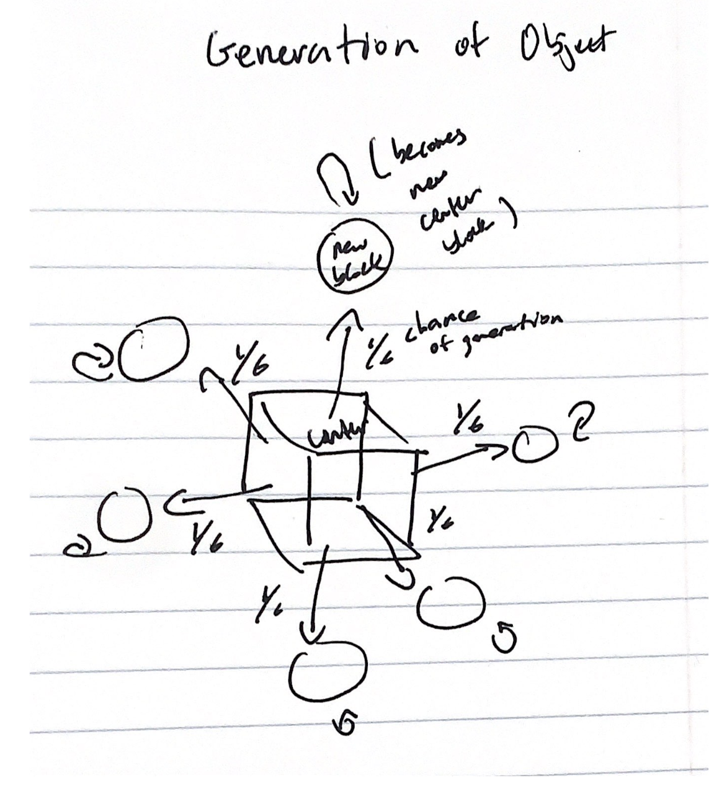
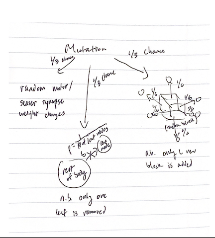
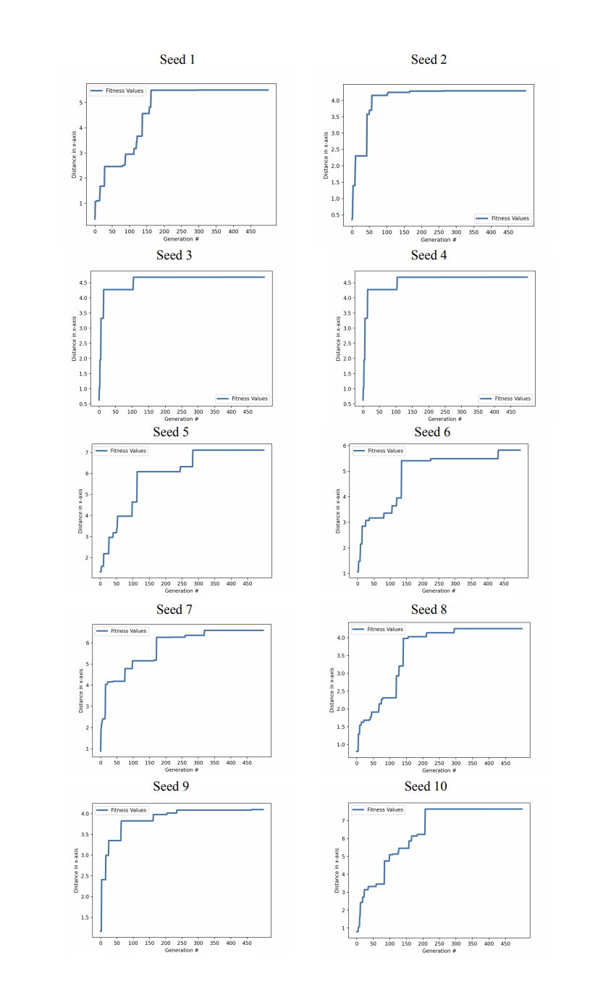
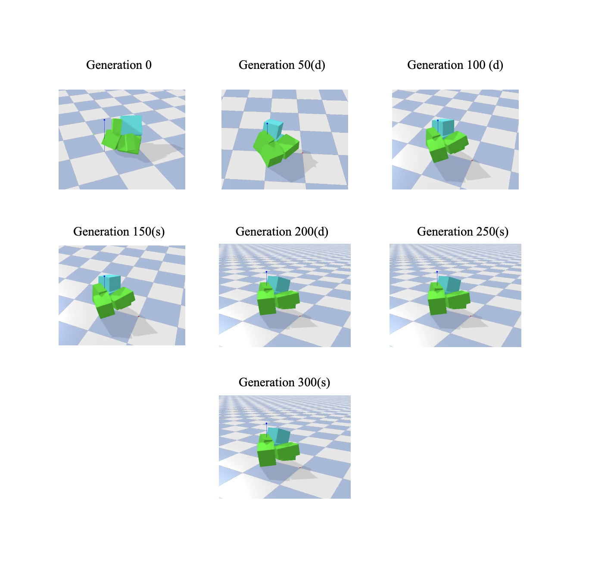

# Final Project - “The Engineer”

### Description
In this assignment, I evolved 10 seeds of random 3d-objects with a population size of 10 and a generation amount of 500 to move in the +x axis. To run the program, run the **search.py** file. Below contains the methods and results of the simulations.

**2 minute movie** (https://youtu.be/Bv_Re1l9b0o):

https://user-images.githubusercontent.com/77948606/225170038-f4be8f02-17fa-434e-ac39-dd23369b4512.mp4 

**GIF of un-evolved vs evolved robots** (https://youtu.be/7gnlgIt3Z1E)

### Methods
The key parts of the implementation for this program are the parallelization logic in **parallelHillClimber.py** and the body/brain generation in **solution.py**. First, by running **search.py**, I create 10 random seeds of the parallel hill climber, which evolves 10 populations over 500 generations. Inside the parallel hill climber, solutions are spawned, mutated, evaluated, and selected (found in the **Evolve_For_One_Generation function**). The original random parents are made in the following fashion: first, a randomly sized rectangular prism is placed at x=0, y=0. Then, there is ⅙ chance that a randomly sized block will grow from that “center” block in each direction. For each block that grows, the procedure recurs, where there is a ⅙ chance that new blocks grow from that block in some direction. This recursion repeats until we reach a recursion depth of 3. For each link, there is a ½ chance it has a sensor neuron, and every joint has a motor neuron, with all sensors connected to all motors via synapses. All of this logic is found in the **generate_3d_body/brain functions in solution.py**. 

After the original parents are made, children are spawned and mutated (as described below), and evolution ensues. I keep track of the best fitness values among the entire population for each generation in **data/**, and I graph these values in **analyze.py**. I also save the urdf files of the highest fitness bodies for each seed in **bestFitnessRobots/**. There is a copy of this directory in case the data gets lost or corrupted.

### Evolution (Fitness and Mutation)
The fitness function is simply distance traveled in the +x direction. Mutations are made as follows: there are three possible mutations that can happen in one generation, each mutually exclusive and occurring with ⅓ probability. First, the weight of a random sensor/motor synapse will be re-randomized. Second, a randomly sized block will be added to a random face of a random pre-existing link. Third, a random block that has no “children” (i.e. no other blocks branching from it) will be removed from the existing body. Children are evaluated with the above fitness function and selection occurs in the normal parallel hill climber way: if a child’s fitness is higher than its parents, it will replace the parent. If not, the parent will be kept for the next generation. All of this logic can be found in the **Mutate function in solution.py** (and the addInstruction/removeInstructions methods).

### Diagrams
Below are diagrams of how the 3d-objects are originally generated, how they mutate, and how they are selected during evolution (all respectively).

### Results

Looking at the fitness curves above, it seems that fitness (or distance in the +x axis) converges to a value around 6, with a high of around 7.5 and a low of 4. This convergence occurs consistently at around generation 150, and sometime as early as generation 100, which suggests that this type of mutation does not have much effect on fitness after this amount of generations. Thus, it is clear that, early on, evolution regularly got “stuck.” Although, before convergence, no individual robot lasted for more than 50 generations. Reviewing the final forms of the robots in the 50,000 sim evolution, we can see that the most fit robots aren’t actually too complicated – made up of mostly single digit links. This fact suggests that the “adding links” mutation isn’t a significantly better mutation than the other 2 options. In fact, in my own analysis of reviewing many simulations, I found that often the best mutations came from changing the weight of a synapse, meaning that brain mutation was much more effective than body mutation. Many of the final robots resembled animal-like creatures: either snakes, spiders, or lizards. Any robots that didn’t resemble these 2d-creatures, had what seemd like legs to walk/bounce around with. To draw these conclusions, I ran around 50 random seeds of 100 generations and population size 10. 

This is an example of an evolution with 1 robot over 300 generations. Robots that are different from the previous form are marked with (d) and robots are the same as before are marked with (s).

What we can see is that, again, the final form’s shape isn’t too much different from the original – there was 1 deletion (from generation 0 to generation 50) and 1 insertion (from generation 50 to generation 100). Most of the change fitness-wise in the robot came from synapse mutations. These pictures also reinforce the idea that fitness "converges," as the last 3 robots are the same (spanning across 150 generations). Again, the ultimate best fit robot isn't too complex and has a relatively small number of link, as concluded before.

### Citation
In this assignment, my codebase is built off of the ludobots wikepedia https://www.reddit.com/r/ludobots/wiki/installation/ and pybullet. Diagrams are inspired by Karl Sims.

