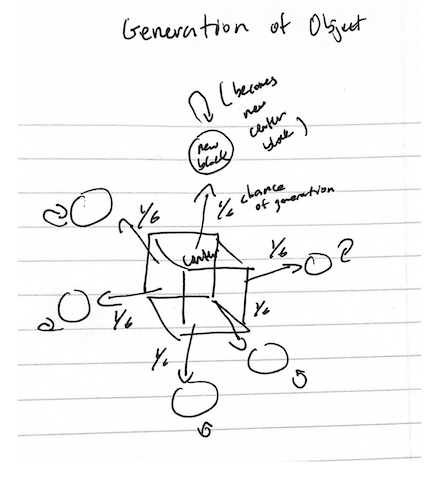

# 3d Object Evolution Assignment

**Description**

In this assignment, I evolved 5 seeds of random 3d-objects with a population size of 10 and a generation amount of 100.
The original random 3d-objects are made in the following fashion: first, a randomly sized rectangular prism is placed at x=0, y=0. Then, there
 is ⅙ chance that a randomly sized block will grow from that “center” block in each direction. For each block that grows, the procedure recurs
, where there is a ⅙ chance that new blocks grow from that block in some direction. This recursion occurs until we reach a recursion depth of 3.
For each link, there is a ½ chance it has a sensor neuron, and every joint has a motor neuron, with all sensors connected to all motors via synapses. 
To run the program, run the search.py file.

**Evolution (Fitness and Mutation)**

The fitness function is simply distance traveled in the +x direction. Mutations are made as follows: there are three possible mutations that
 can happen in one generation, each mutually exclusive and occurring with ⅓ probability. First, the weight of a random sensor/motor synapse will be re-randomized
. Second, a randomly sized block will be added to a random face of a random pre-existing link. Third, a random block that has no “children” (i.e. 

no other blocks branching from it) wil be removed from the existing body.

## Fitness Curves located in fitnessCurves.pdf

**Citation**

In this assignment, my codebase is built off of the ludobots wikepedia https://www.reddit.com/r/ludobots/wiki/installation/ and pybullet.

**Diagram**

Below are diagrams of how the 3d-objects are originally generated and how they mutate

 

